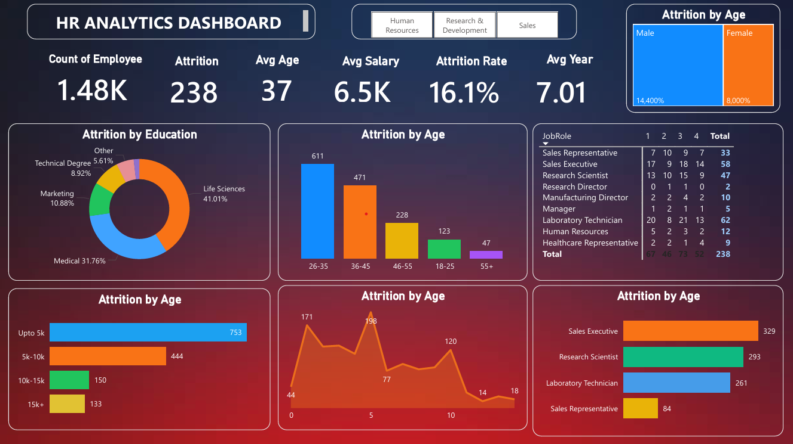

# HR Analytics Dashboard – Power BI Project

## Project Overview

This project is an interactive HR Analytics Dashboard built using Power BI to analyze employee attrition and workforce trends.

The dashboard helps HR teams and management understand:

* Employee attrition patterns
* Salary distribution
* Employee demographics
* Department-wise insights
* Job role analysis
* Employee experience trends

---

## Objectives

* Analyze employee attrition trends
* Identify departments with high attrition
* Understand salary slab impact on attrition
* Compare employee distribution across age groups
* Generate actionable HR insights

---

## Tools & Technologies Used

* Power BI
* Excel / CSV Dataset
* DAX Calculations
* Data Cleaning
* Data Visualization

---

## Dashboard Features

### KPI Cards

* Total Employees
* Attrition Count
* Attrition Rate
* Average Salary
* Average Age
* Average Years at Company

### Visualizations

* Attrition by Education
* Attrition by Age Group
* Attrition by Salary Slab
* Attrition by Job Role
* Attrition by Years at Company
* Gender-wise Attrition Analysis

---

## Dashboard Preview

Upload your dashboard screenshot as:

dashboard.png

Then use:

---

## Key Insights

* Highest attrition occurs in the 26–35 age group.
* Life Sciences employees show the highest attrition percentage.
* Employees earning below 5K salary have maximum attrition.
* Sales Executive role records the highest attrition count.
* Employees with fewer years at the company show higher attrition trends.

---

## Business Impact

This dashboard helps HR departments:

* Improve employee retention strategies
* Identify high-risk attrition groups
* Optimize workforce planning
* Support data-driven HR decisions

---

## Files Included

* HR_Analytics.pbix
* HR_Analytics_Power_BI.pdf
* HR_Analytics123.csv
* dashboard.png
* README.md

---

## Future Improvements

* Add department-level drill-through analysis
* Add employee performance analysis
* Connect dashboard with live database
* Add predictive attrition analysis using Machine Learning

---

## Author

### Prajyot Yesankar

Aspiring Data Analyst passionate about Power BI, SQL, Excel, and Data Visualization.

## Connect With Me

LinkedIn: [Prajyot Yesankar LinkedIn](https://www.linkedin.com/in/prajyot-yesankar-79215b258/?utm_source=chatgpt.com)

GitHub: [yesankarprajyot123 GitHub](https://github.com/yesankarprajyot123?utm_source=chatgpt.com)
